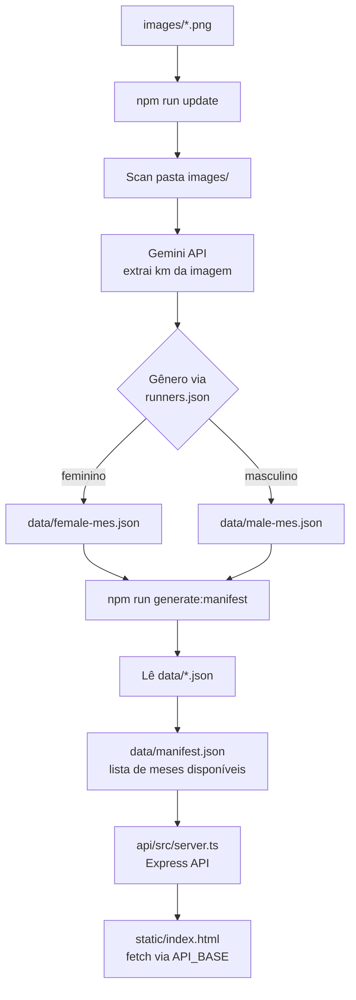

# R&T Clube de Corrida - Ranking Endurance

Simples monorepo para automação de atualização de rankings do clube de corrida da R&T Academia

O script lê screenshots de apps de corrida (Strava, Garmin, Nike Run, etc.), extrai o km percorrido via IA, utilizando o Gemini, salva em arquivos JSON locais, disponibiliza os dados via API e gera a página estática com os rankings.

## Fluxo



## Estrutura

```
rt-ranking-endurance/
├── api/                          # Servidor Express (deployado no Render)
│   ├── src/server.ts             # 4 endpoints REST + CORS + rate limiting
│   ├── package.json
│   └── tsconfig.json
├── static/                       # Frontend estático (deployado no Render)
│   ├── index.html                # Página com rankings e navegação por abas
│   └── assets/
│       ├── app.js                # Lógica do browser (fetch, ranking, UI)
│       └── style.css             # Estilos da página
├── processor/                    # CLI local (não deployado)
│   ├── index.ts                  # CLI principal — processa imagens e salva JSONs
│   ├── imageAnalyzerGemini.ts    # Gemini Vision: extrai km da imagem
│   ├── clearImages.ts            # Limpa a pasta /images
│   ├── imageFiles.ts             # Funções para gerenciamento da pasta /images
│   ├── manifest.ts               # Gera o data/manifest.json
│   ├── jsonUpdater.ts            # Lê e escreve os arquivos JSON de dados
│   ├── participantsParser.ts     # Carrega data/runners.json
│   └── cacheManager.ts           # Cache de imagens por hash SHA256
├── data/
│   ├── runners.json              # Lista de participantes por gênero
│   ├── manifest.json             # Meses disponíveis (gerado por npm run generate:manifest)
│   ├── female-[mes].json         # Dados mensais femininos (gerado por npm run update)
│   └── male-[mes].json           # Dados mensais masculinos (gerado por npm run update)
├── images/                       # Coloque aqui os screenshots dos corredores
├── render.yaml                   # Configuração de deploy no Render.com
├── .env.example                  # Modelos das variáveis de ambiente
├── package.json
└── tsconfig.json
```

## Pré-requisitos

- Node.js 22+
- Conta no [Google AI Studio](https://aistudio.google.com) com acesso à API Gemini

## Instalação

```bash
npm install
cd api && npm install
```

## Configuração

### Variáveis de ambiente

Copie o arquivo de exemplo e preencha os valores:

```bash
cp .env.example .env
```

| Variável | Descrição |
|---|---|
| `GEMINI_API_KEY` | Chave da API Google Gemini (obrigatória) |
| `CURRENT_MONTH` | Sobrescreve o mês atual (opcional, ex: `4` para abril) |

## Configurando o API Gemini

Para usar o processamento das imagens, é preciso adicionar sua chave da API do Gemini.

Para obter a chave, acesse o [https://ai.google.dev/gemini-api/docs/api-key?hl=pt-br](https://ai.google.dev/gemini-api/docs/api-key?hl=pt-br)

## Uso

### 1. Processar imagens

Coloque os screenshots na pasta `images/` com o nome do corredor como nome do arquivo:

```bash
cp ~/Downloads/eli.png images/
cp ~/Downloads/tiago.png images/
```

Execute:

```bash
npm run update
```

Saída esperada:

```
Processando eli.png... Eli → 19.04km ✓
Processando tiago.png... Tiago → 23.06km ✓

Resumo:
  eli.png → Eli (female) → 19.04km
  tiago.png → Tiago (male) → 23.06km
```

### 2. Gerar manifest.json

```bash
npm run generate:manifest
```

Gera o arquivo:
- `data/manifest.json` — lista de meses disponíveis para o frontend

### 3. Limpar pasta "images"

```bash
npm run clear:images
```

Remove todas imagens existentes na pasta `/images`

### 4. Visualizar rankings no browser (desenvolvimento local)

Terminal 1 — inicia a API:

```bash
npm run api:dev
```

Terminal 2 — serve o frontend:

```bash
npm run serve
```

Acesse `http://localhost:3000` para ver os rankings com navegação por abas e o botão "Copiar para WhatsApp".

## Deploy (Render.com)

O arquivo `render.yaml` configura dois serviços independentes:

| Serviço | Tipo | Diretório |
|---|---|---|
| `rt-ranking-endurance-api` | Web (Node) | `api/` |
| `rt-ranking-endurance-static` | Static Site | `static/` |

A API lê os JSONs de `data/` (commitados no repositório) e os expõe via 4 endpoints:

```
GET /api/manifest
GET /api/runners
GET /api/data/:month/female
GET /api/data/:month/male
```

O frontend detecta o ambiente automaticamente: usa `http://localhost:3001` em desenvolvimento e `https://rt-ranking-endurance-api.onrender.com` em produção.

## Formatos de imagem suportados

`.png`, `.jpg`, `.jpeg`, `.webp`, `.gif`

## Observações

- O nome do arquivo define o nome do corredor (ex: `tiago.png` → `Tiago`)
- O corredor deve estar cadastrado em `data/runners.json` para ser reconhecido
- O cache em `data/.image-cache.json` evita reprocessar a mesma imagem
- `.env` está no  `.gitignore` e nunca deve ser commitado
