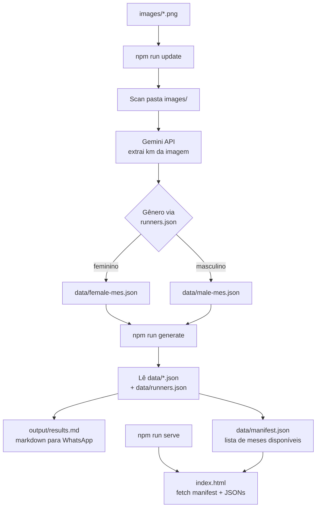

# R&T Clube de Corrida - Ranking Endurance

Automação de atualização de rankings de corrida para o clube de corrida da R&T Academia. 

O script lê screenshots de apps de corrida (Strava, Garmin, etc.), extrai o km percorrido via IA, utilizando o Gemini, salva em arquivos JSON locais e gera a página estática com os rankings e o arquivo `results.md` no formato markdown para compartilhamento no WhatsApp.

## Fluxo



## Estrutura

```
rt-ranking/
├── generator/
│   ├── index.ts                  # CLI principal — processa imagens e salva JSONs
│   ├── imageAnalyzerGemini.ts    # Gemini Vision: extrai km da imagem
│   ├── htmlGenerator.ts          # Gera output/results.md e data/manifest.json
│   ├── jsonUpdater.ts            # Lê e escreve os arquivos JSON de dados
│   ├── participantsParser.ts     # Carrega data/runners.json
│   └── cacheManager.ts           # Cache de imagens por hash SHA256
├── assets/
│   ├── app.js                    # Lógica do browser (fetch, ranking, UI)
│   └── style.css                 # Estilos da página
├── data/
│   ├── runners.json              # Lista de participantes por gênero
│   ├── manifest.json             # Meses disponíveis (gerado por npm run generate)
│   ├── female-[mes].json         # Dados mensais femininos (gerado por npm run update)
│   └── male-[mes].json           # Dados mensais masculinos (gerado por npm run update)
├── images/                       # Coloque aqui os screenshots dos corredores
├── output/
│   └── results.md                # Markdown para envio no WhatsApp
├── index.html                    # Página estática com rankings (carrega JSONs via fetch)
├── .env                          # Variáveis de ambiente (não commitado)
├── .env.example                  # Modelo das variáveis
├── package.json
└── tsconfig.json
```

## Pré-requisitos

- Node.js 22+
- Conta no [Google AI Studio](https://aistudio.google.com) com acesso à API Gemini

## Instalação

```bash
npm install
```

## Configuração

### Variáveis de ambiente

Copie o arquivo de exemplo e preencha os valores:

```bash
cp .env.example .env
```

| Variável | Descrição |
|---|---|
| `GEMINI_API_KEY` | Chave da API Google Gemini (obrigatória) |
| `CURRENT_MONTH` | Sobrescreve o mês atual (opcional, ex: `4` para abril) |

## Uso

### 1. Processar imagens

Coloque os screenshots na pasta `images/` com o nome do corredor como nome do arquivo:

```bash
cp ~/Downloads/eli.png images/
cp ~/Downloads/tiago.png images/
```

Execute:

```bash
npm run update
```

Saída esperada:

```
Processando eli.png... Eli → 19.04km ✓
Processando tiago.png... Tiago → 23.06km ✓

Resumo:
  eli.png → Eli (female) → 19.04km
  tiago.png → Tiago (male) → 23.06km
```

### 2. Gerar rankings

```bash
npm run generate
```

Gera dois arquivos:
- `output/results.md` — markdown pronto para colar no WhatsApp
- `data/manifest.json` — lista de meses disponíveis para o `index.html`

### 3. Visualizar rankings no browser

```bash
npm run serve
```

Acesse `http://localhost:3000` para ver os rankings com navegação por abas e o botão "Copiar para WhatsApp".

## Formatos de imagem suportados

`.png`, `.jpg`, `.jpeg`, `.webp`, `.gif`

## Observações

- O nome do arquivo define o nome do corredor (ex: `tiago.png` → `Tiago`)
- O corredor deve estar cadastrado em `data/runners.json` para ser reconhecido
- O cache em `data/.image-cache.json` evita reprocessar a mesma imagem
- `.env` e o `credentials.json` estão no `.gitignore` e nunca devem ser commitados
